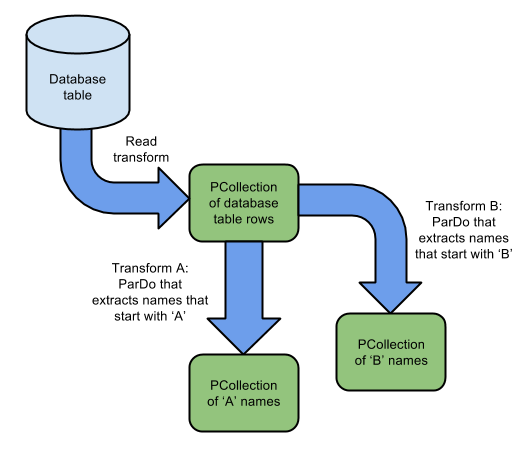

# pubsub_beam_bigquery
_____

This repo is an example of using Apache Beam to consume messages from a Google cloud pub/sub topic and publish rows in different tables in BigQuery.

---
OSX dev guide 

Pre-requisites: 
- Python2 and virtualenv installed
- gcloud installed and initialized with proper GCP credentials OR set ```GOOGLE_APPLICATION_CREDENTIALS``` environment variable to the location of json file with credentials (Example: ```export GOOGLE_APPLICATION_CREDENTIALS=path/to/credentials.json``` ). To verify your gcloud credentials: ```gcloud config list```. To reset the credentials: ```gcloud init```.
- Pub/Sub and BigQuery API enabled using GCP Console in one project. Replace ```[PROJECT_ID]``` in beam_pubsub_bigquery.py with appropriate project id from GCP.
- Create a topic on Pub/Sub and a subscriber to that topic. Replace ```[TOPIC_NAME]``` and ```[SUBSCRIBER_NAME]``` in beam_pubsub_bigquery.py & pubsub.js with appropriate topic name.
- Create a tables on BigQuery in a dataset. Replace ```[DATASET_NAME]``` and ```[TABLE_NAME]``` in beam_pubsub_bigquery.py with appropriate dataset and table names respectively.

Virtual Environment Setup:
```bash
python2 -m virtualenv venv
source venv/bin/activate
pip install apache-beam[gcp]
deactivate
```

Starting Apache Beam:
```
source venv/bin/activate
python beam_pubsub_bigquery.py --input_topic 'projects/[PROJECT_ID]/topics/[TOPIC_NAME]' --runner DirectRunner
```

Stopping Apache Beam:
```bash
Ctrl+C
deactivate
```

---
Current pipeline accepts a JSON payload with ```'event_name'``` key set from ```'projects/[PROJECT_ID]/topics/[TOPIC_NAME]'``` pubsub topic. If the value to this key is ```'super duper event - 1'```, a tagged (with tag ```'super duper'```) output (or PValue) is generated. For each of the tagged PValues with tag ```'super duper'```, an entry is made to a table in BigQuery called ```'[PROJECT_ID]:[DATASET_NAME].[TABLE_NAME]'```. A linear architecture (like the one coded in this repo) looks like:


For one event received, multiple tagged PValues can also be generated using multiple yield statements in python, as shown below:



Using different tags, entries can be made to different tables. There must always be one-to-one mapping between tables and tags generated from PTransforms.

---
Misc/Troubleshoot:
- To publish a payload to Cloud Pub/Sub: ```node pubsub.js publish```
- To pull payloads from Cloud Pub/Sub: ```node pubsub.js subscribe```
- Why use ```yield``` vs ```return``` keyword in python? [[link](https://pythontips.com/2013/09/29/the-python-yield-keyword-explained/)]
- Apache Beam Programming Guide [[link](https://beam.apache.org/documentation/programming-guide/)]
- To create a new subscription: ```gcloud pubsub subscriptions create mySub --topic myTopic```
- JS date time to SQL date time [[link](https://stackoverflow.com/questions/5129624/convert-js-date-time-to-mysql-datetime)]
- Install google-cloud/pubsub on npm: ```npm install --save @google-cloud/pubsub```
- Passing command line arguments to node [[link](https://stackabuse.com/command-line-arguments-in-node-js/)]
- ```'past.builtins' python module not found```: Make sure virtualenv is active. Do: ```python2 -m pip install future```
- ```'AttributeError: 'unicode' object has no attribute 'items' [while running 'tf1/WriteToBigQuery']'```: Check if passing a string instead of a python object to BigQuery. Use ast.literal_eval() to convert string to a valid python object.
- ```'Access Denied: Table [PROJECT_ID]:[DATASET_NAME].[TABLE_NAME]: The user xxxx.iam.gserviceaccount.com does not have bigquery.tables.get permission for table [PROJECT_ID]:[DATASET_NAME].[TABLE_NAME].'```: go to GCP console IAM & Admin to fix persmissions for service account.
- JS custom timezone [[link](https://www.techrepublic.com/article/convert-the-local-time-to-another-time-zone-with-this-javascript/)]